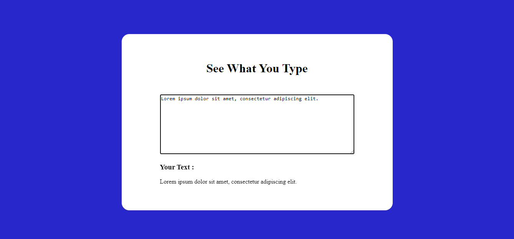

# PRANAV MATHUR

## Learnings from the project:

- Getting input _value_ from textarea and changing _innerText_ of output field

## Time taken:

    It took me 20 minutes to complete this project.

## Screenshots:

## Live link:

[Go to site](https://08-see-what-you-type.netlify.app/)
